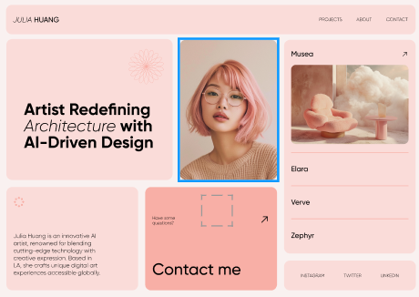

# Portf-lio_Rosa

Este projeto consiste no desenvolvimento de uma landing page responsiva utilizando HTML5 e Tailwind CSS, com o objetivo de apresentar o portfólio.
A proposta visual é moderna, minimalista e estética, priorizando a harmonia entre elementos gráficos e tipográficos. O layout foi estruturado em três colunas principais, adaptando-se de forma fluida a diferentes tamanhos de tela (desktop, tablet e mobile). Entre os principais componentes da página, destacam-se:

- Header fixo com navegação intuitiva

- Mensagem de destaque com tipografia variada para reforçar o posicionamento da artista

- Imagem de perfil centralizada com tratamento visual e proporção adequada

- Área de projetos, destacando obras com nomes sugestivos como "Musea", "Elara", "Verve" e "Zephyr"

- Seção sobre a artista, com uma breve biografia

- Bloco de contato com chamada à ação clara e objetiva

- Footer com links para redes sociais

O projeto demonstra domínio em design responsivo, uso de classes utilitárias do Tailwind, alinhamento visual e organização semântica do código. A identidade visual em tons rosados reforça o estilo artístico da personagem e cria uma experiência visual acolhedora.

# Tecnologias Utilizadas

- HTML
- CSS
- Tailwind
- Responsividade
- Markdown

---

# Autora

[Aline Alves de Souza](https://github.com/AlineMaker)

